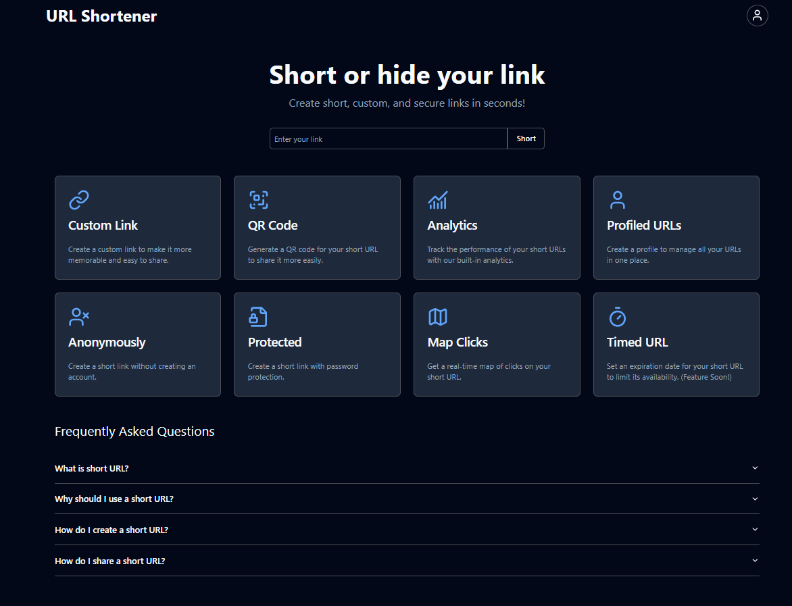
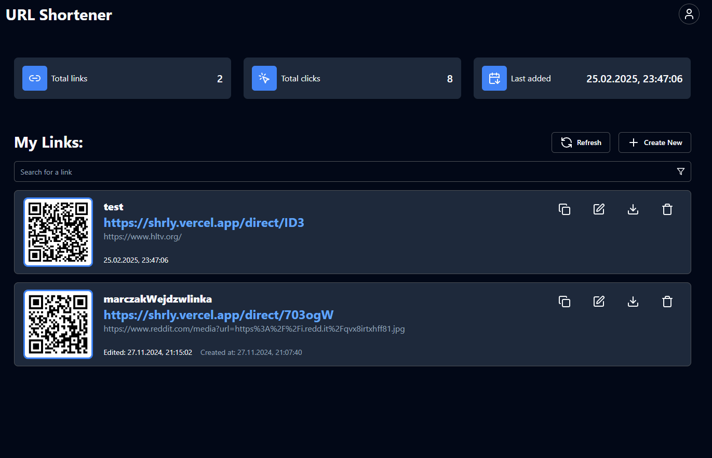
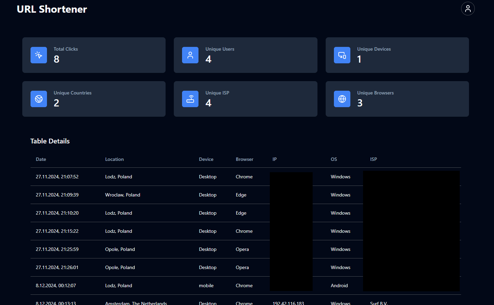

# Links shortener

This is a full stack application that allows to shorten long URLs to a more manageable size.

## 🚀 Preview

Preview the application live on [https://shrly.vercel.app/](https://shrly.vercel.app/)

Landing page:

Dashboard page:

Statistics page:

## 🛠 Technologies

### Frontend

- React v18
- TypeScript
- TailwindCSS v3
- Shadcn (UI)
- Leaflet (Map)
- Zod & useForm (Form validation)

### Backend

- Express
- TypeScript
- Prisma
- Supabase (Auth & DB)
- Zod (Schema validation)

### Deployment

- Vercel (Frontend)
- Vercel (Backend)
- Supabase (DB)
- CI/CD (GitHub Actions)

## ✨ Features

- Authentication (Sign up, Sign in, Sign out)
- Shorten URLs (anonymous or authenticated)
- Custom & auto-generated short URLs
- Password-protected URLs
- QR code generation related to the short URL
- Created url actions (edit, delete, copy, download QR code, preview QR code)
- Analytics (clicks, user meta data, user agent, referrer)
- Map view (geolocation visitors)
